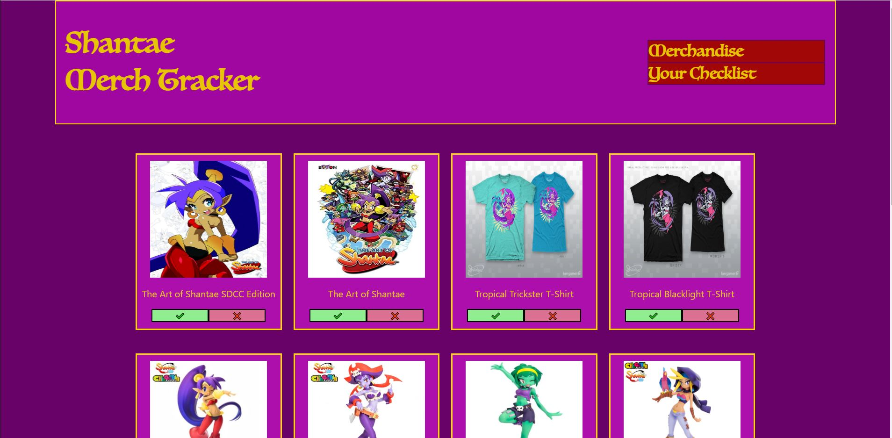
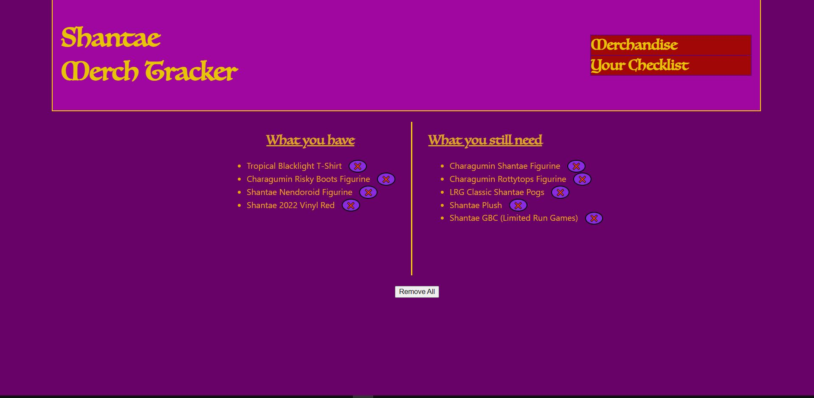

# Shantae Tracker

## Table of Contents

- [Description](#description)
- [Installation](#installation)
- [Usage](#usage)
- [Contributing](#contributing)
- [Technologies Used](#technologies-used)

## Description

This is a website that allows the user to track what Shantae merchadise items they have and do not have by compiling them in a list. (Note that this is only a proof of concept and merchandise will be added to it periodically)
Your information will be logged and stored on your local computer.

## Installation

```
npm i
```

## Usage

Click on the colored buttons underneath the pictures of the merchandise. If you have the item, click on the checkmark. If you do not, click on the X. To view your list, click on the Your List button at the top of the page. If you want to remove an item, click the X next to any item you wish to remove. If you want to remove all items, click the "remove all" button at the bottom of the page.

## Contributing

Contact me if you want to add more merchandise to the growing list or if I have missed something and I will add it as soon as I can.

## Technologies-Used

- Bootstrapped with create-react-app
- react-dom
- react-router-dom
- web-local-storage-API

## To-Do

- Add filtering functionality to filter by game.
- Add search functionality to search for specific merchandise
- Add more merchandise to database (ideally exposed via API)

## Screenshot




